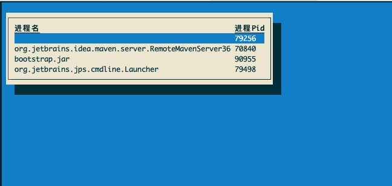

<a href="https://github.com/ymm-tech/easy-byte-coder/blob/master/README_CN.md" title="中文说明">中文说明</a>

<a href="https://github.com/ymm-tech/easy-byte-coder/wiki">WIKI Manual</a>

# Easy-byte-coder

## Introduction

Easy-byte-coder is a non-invasive bytecode injection framework based on JVM. Java application developers can implement bytecode injection quickly, without caring about the underlying **instrument** principle and implementation details. Easy-byte-coder provides AOP ability in the form of plugin. Static waving (**Agent**) and dynamic waving (**Attach**) make plugin development easy. 

## How to use Easy-byte-coder?

In Attach mode, Easy-byte-coder depends on the jvm runtime environment variable, please make sure **JAVA_HOME** existed. Agent mode has no need for this setting.

Starting in Attach mode:

```
java -Xbootclasspath/a:$JAVA_HOME/lib/tools.jar -jar bootstrap.jar
```

 Next, selecting the process to inject:



If injection successes, you should see something like:

```
Attaching to target JVM with PID: 91420
Attached to target JVM and loaded Java agent successfully
```

If you need to modify JDK source codes, like injecting JDK methods, or making many modifications when starting, you can use Agent mode.

Starting in Agent mode:

```
-javaagent:/Users/xujie/work/ymm/jar/agent.jar=plugins=systemtime.jar:RunMode=mock
```

## How Easy-byte-coder works?

### Pointcut

In Easy-byte-coder, you can implement injection of method pointcuts by extending interface meanwhile specifying the class to modify. These pointcuts allowed to use currently include: 

- LocalVariables: add LocalVariables in method.
- Before: modify before mothed execution.
- After: modify before mothed return.
- Catch: catch customized exception.
- Body: replace the whole mothod body.

### Class isolation

Easy-byte-coder implements class isolation by applying different class loaderes, which makes application classes and zodiac classes not interfere with each other. 

### Resource Manager

The resource manager ZodiacResourceObjectPool make developers easily switch and obtain class loaderes of application space runtime and zodiac. By calling the objects of application space, you can reuse some basic functions in original application, and then improve development efficiency.

### spi-plugin

Easy-byte-coder apply java spi to load plugins. When developing plugins, after extending specified interface and implementing methods, the bytecode injection for the appliction completed. In the whole process, you have no need to care about the underlying principle.

## Where use Easy-byte-coder?

The use scenes of Easy-byte-coder be applied include:

- non-invasive log and report
- non-invasive online accident simulation
- non-invasive repair for online error codes
- Imperceptible return of mock data when debugging locally
- Comparison of online traffic recording and replaying result

## Contact us


## Contributing


## To be continue 

1. Virgo: a locally-mock debugging tool for microservice
2. Gemini: a traffic recording and replaying tool for microservice


